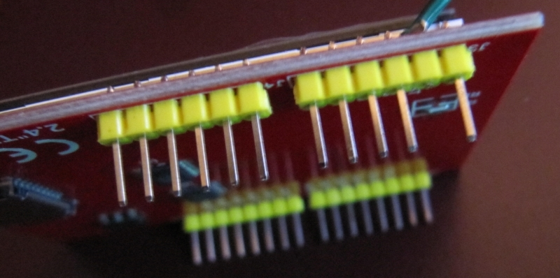
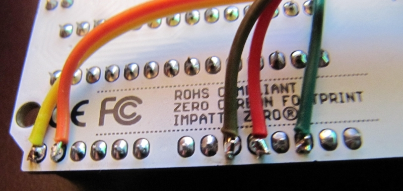
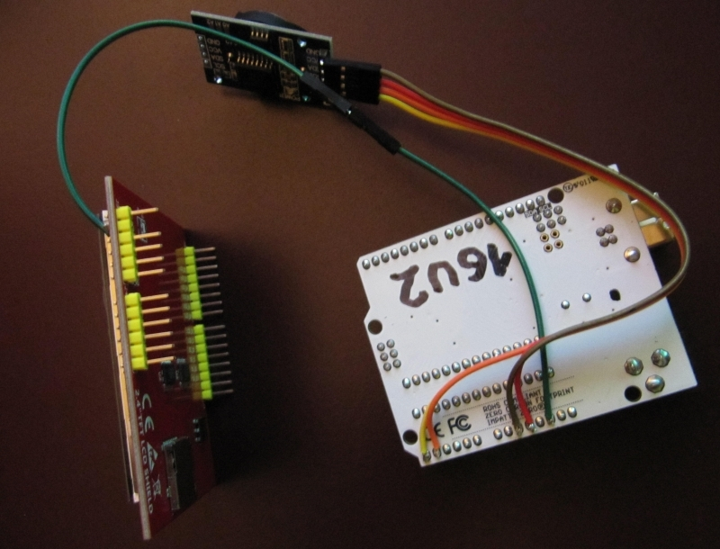
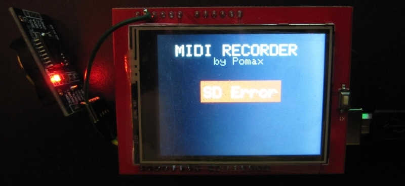
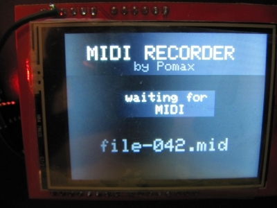
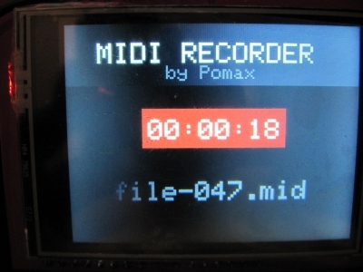

# Arduino UNO based MIDI recorder
Original created by [Pomax](https://github.com/Pomax/arduino-midi-recorder)  

This fork uses a TFT Shield with SD-card slot. Further only USB-Midi is used (see [firmware](https://github.com/othmar52/arduino-midi-recorder/tree/master/firmware) to turn your Arduino UNO into a class compliant USB MIDI device).  

## Building

In case you want to use the combination of
 - Arduino UNO
 - AZDelivery 2.4TFT LCD Touch Display Parent
 - DS3231 Real Time Clock

### cut the pin `LCD_RST` of the TFT shield  
  

### add some wires
```
   DS3231 Real Time Clock
   https://www.amazon.de/dp/B01M2B7HQB
                        ____________________________
                       |                            |
                       |_                           |
                       |•|32K                       |
                       |•|SQW                       |
   to Arduino UNO A5 <-|•|SCL         PINS of       |
   to Arduino UNO A4 <-|•|SDA         DS3231        |
   to Arduino UNO 5V <-|•|VCC                       |
  to Arduino UNO GND <-|•|GND                       |
                       |¯                           |
                       |____________________________|

```
the cut pin of the TFT shild has to be wired to Arduino UNO's `RESET` pin  
  

### connect all cables
  

### connect shield with the Arduino UNO
  

## Display

  
  
